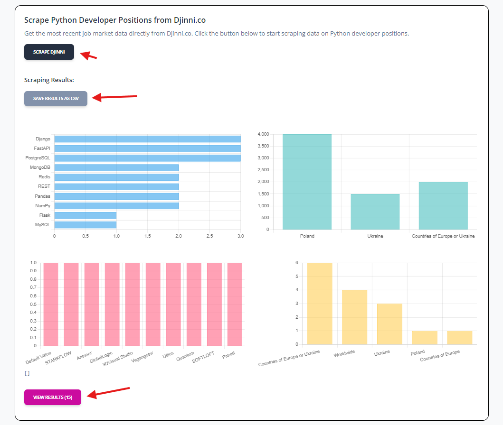
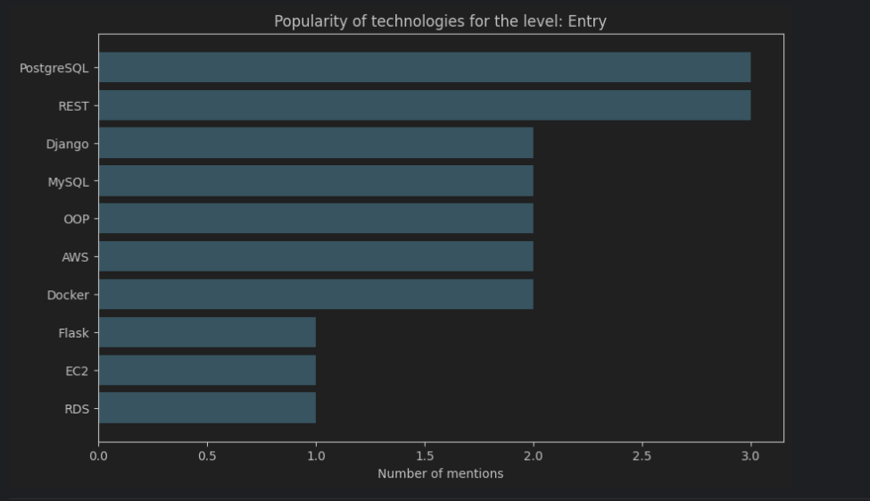

# Job Listings Technology Analysis


<br>
### This service provides you with up-to-date insights into the most demanded technologies in the tech job market, specifically tailored for Python developers. Whether you're a beginner or an experienced professional, understanding which technologies are currently in demand is crucial for advancing your career.
## Content

1. [Project Description](#project-description)
2. [Installation](#installation)
3. [Usage](#usage)
4. [Data Structure](#data-structure)
5. [Examples](#examples)

## Project description

This project includes the following features:
### 👨‍💻 Vacancy Listings
- Explore the latest Python developer job openings, complete with details on required technologies, company, location, and experience level.
### 📊 Technology Statistics
- Get a clear view of the most mentioned technologies across job postings. Our service aggregates and analyzes data to highlight the tools and frameworks that are most sought after by employers.
### 📈 Historical Data
- Track trends over time. See how the popularity of different technologies has evolved, helping you identify emerging trends and shifts in the job market.
### 📁 Downloadable Reports
- Export the data you need in CSV format for deeper analysis. Whether you're a researcher or just keen on data, our downloadable reports give you the flexibility to explore the information further.

## Installation 💻

### 1. Clone the repository:
```bash
git clone https://github.com/your-username/job-listings-tech-analysis.git
 ```

### 2. Install modules via `VENV`:
Set Up for `Unix`, `MacOS`
```bash
virtualenv env
source env/bin/activate
pip3 install -r requirements.txt
 ```

Set Up for `Windows`
```bash
virtualenv env
souce venv\Scripts\activate
pip install -r requirements.txt
```

### 3. Launch the project:
```bash
python manage.py runserver
```

## Usage 🤝

### On the page that opens, select the source and start scarp. After that, download the file and in the data_analysis/ folder, perform the necessary analysis.

## Data stucture 📄

### Vacancies data format

- **title**: Job title
- **company**: Company
- **location**: Location
- **years_of_experience**: Number of years of experience
- **salary**: Salary
- **english_level**: English level
- **technologies**: Technologies used
- **seniority_level**: Experience level (entry, junior, middle, senior)
- **date_posted**: Date posted
- **source**: Source of job posting

### Examples

<br>

```csv
Title,Company,Location,Years_of_experience,Salary_$,Seniority_level,English_level,Technologies,Date_Posted,Source
Senior Python Engineer with Elasticsearch,GlobalLogic,Ukraine,3,,Lead,Intermediate,["React"],,djinni.co
Odoo developer,Antenor,Ukraine,3,1500,,,[],,djinni.co
Senior Python Engineer,Proxet,Countries of Europe or Ukraine,5,4000,Senior,Upper-Intermediate,["Django"],,djinni.co
Python developer(+Angular),SOFTLOFT,Worldwide,2,,,Intermediate,[],,djinni.co
Middle Python Developer,Vegangster,Countries of Europe,2,,Middle,Intermediate,["Tornado"; "PostgreSQL"; "MongoDB"; "Redis"; "aiohttp"; "Make"],,djinni.co
Python Backend Developer (Middle),Default Value,Countries of Europe or Ukraine,2,,,Intermediate,[],,djinni.co
Prompt engineer,3DVisual Studio,Worldwide,,,,Upper-Intermediate,[],,djinni.co
RoboDK Engineer and Consultant,A-LISTWARE,Ukraine,3,,,Intermediate,[],,djinni.co
...
```

<br>
